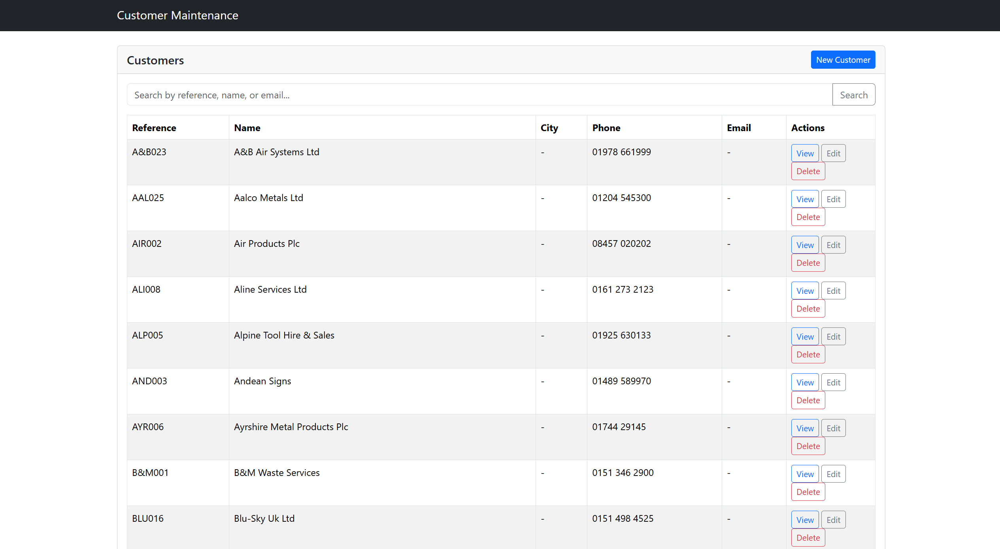
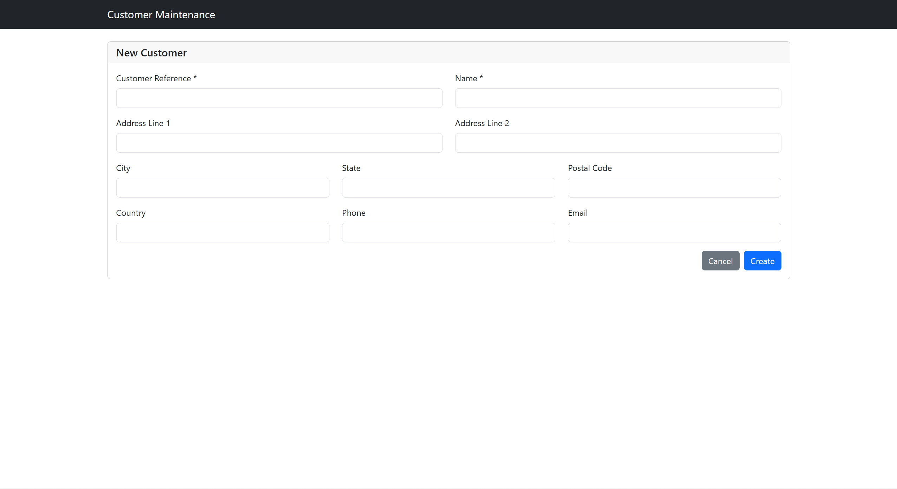
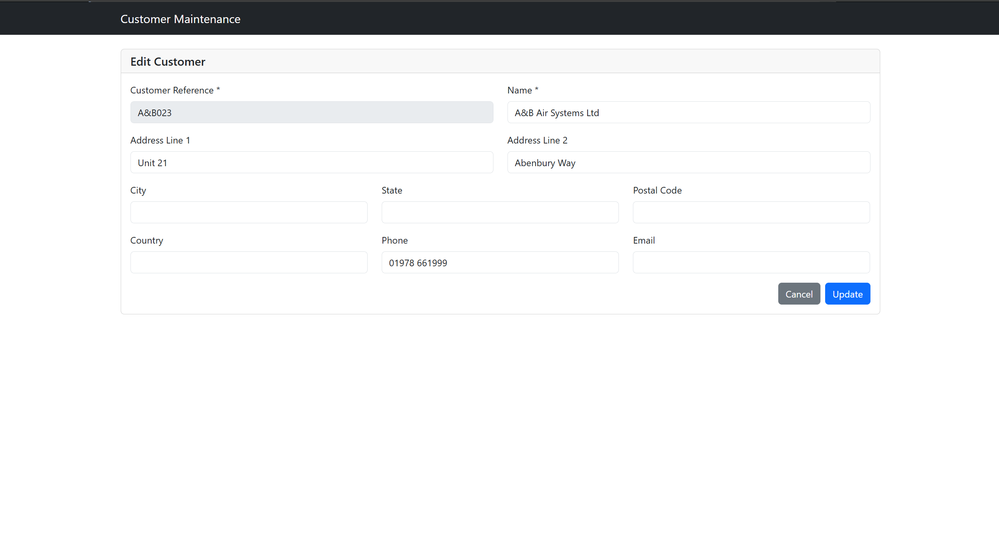

# Customer Maintenance

A full-stack web application for managing customer master data stored on IBM i (AS/400). Built with React, TypeScript, Express, and IBM's Mapepire JS for IBM i database connectivity.

## Features

- Paginated customer list (20 records per page)
- Search by customer reference, name, or contact
- Create, view, edit, and delete customer records
- Responsive Bootstrap 5 UI
- Full TypeScript on both client and server

---

## Screenshots

**Customer List** — paginated table with search and actions for each record.



**New Customer** — form for creating a new customer record.



**Edit Customer** — form pre-populated with the selected customer's data.



---

## Table of Contents

1. [Prerequisites](#prerequisites)
2. [IBM i Database Setup](#ibm-i-database-setup)
3. [Mapepire Server Setup on IBM i](#mapepire-server-setup-on-ibm-i)
4. [Installation](#installation)
5. [Configuration](#configuration)
6. [Running the Application](#running-the-application)
7. [Building for Production](#building-for-production)
8. [API Reference](#api-reference)
9. [Project Structure](#project-structure)
10. [Troubleshooting](#troubleshooting)

---

## Prerequisites

- **Node.js** 18 or later
- **npm** 9 or later
- **IBM i** system with:
  - Mapepire server installed and running (see [Mapepire Server Setup](#mapepire-server-setup-on-ibm-i))
  - A user profile with `*USE` authority to the target library and `*CHANGE` authority to `CUSTMAST`
  - The `CUSTMAST` table created in your target library (see [IBM i Database Setup](#ibm-i-database-setup))

---

## IBM i Database Setup

The application reads from and writes to a table named `CUSTMAST` in the library specified by `IBMI_LIBRARY` in your `.env` file.

### Create the CUSTMAST Table

Run the following SQL statement on your IBM i system using ACS Run SQL Scripts, green-screen interactive SQL (`STRSQL`), or any SQL client:

```sql
CREATE TABLE MYLIB.CUSTMAST (
    CUSTREF   CHAR(10)      NOT NULL,
    NAME      CHAR(50)      NOT NULL,
    SHORTNAME CHAR(20)          NULL,
    ADDRESS1  CHAR(50)          NULL,
    ADDRESS2  CHAR(50)          NULL,
    ADDRESS3  CHAR(50)          NULL,
    ADDRESS4  CHAR(50)          NULL,
    POSTCODE  CHAR(15)          NULL,
    CREDLMT   DECIMAL(13, 2)    NULL,
    PHONE     CHAR(20)          NULL,
    WEBSITE   CHAR(100)         NULL,
    CONTACT   CHAR(50)          NULL,
    CONSTRAINT CUSTMAST_PK PRIMARY KEY (CUSTREF)
);
```

> Replace `MYLIB` with the library name you intend to use. That same name goes into `IBMI_LIBRARY` in your `.env` file.

### Optional: Load Sample Data

```sql
INSERT INTO MYLIB.CUSTMAST VALUES
    ('ACME001', 'Acme Corporation', 'Acme', '123 Main St', '', 'Springfield', 'IL', '62701', 50000.00, '555-100-0001', 'www.acme.com', 'Wile E. Coyote'),
    ('GLOBEX01', 'Globex Corporation', 'Globex', '1 Globex Way', '', 'Shelbyville', 'IL', '62565', 75000.00, '555-100-0002', 'www.globex.com', 'Hank Scorpio');
```

### Required IBM i Authorities

The IBM i user profile specified in `IBMI_USER` needs the following object authorities:

| Object | Type | Authority |
|--------|------|-----------|
| `IBMI_LIBRARY` (library) | `*LIB` | `*USE` |
| `CUSTMAST` | `*FILE` | `*CHANGE` |
| `QSYS2` (system schema) | `*LIB` | `*USE` |

---

## Mapepire Server Setup on IBM i

This application connects to IBM i through **Mapepire**, an open-source REST/WebSocket server that runs on the IBM i and exposes a SQL execution interface.

### What is Mapepire?

Mapepire eliminates the need for ODBC drivers on the client machine. Instead, a lightweight server process runs on the IBM i and accepts connections over a standard port (default **8076**). The Node.js client (`@ibm/mapepire-js`) communicates with it over WebSocket.

### Installing Mapepire via ACS Open Source Manager

The easiest way to install Mapepire on IBM i is through the **IBM Access Client Solutions (ACS) Open Source Package Manager**.

1. **Open ACS** and connect to your IBM i system.

2. From the ACS menu, go to **Tools → Open Source Package Management**.

3. ACS will display the Open Source Package Manager. Select your IBM i system from the dropdown if it is not already selected and click **Refresh** to load the available packages.

4. In the package list, locate **mapepire-server**. You can type `mapepire` in the filter/search box to narrow the list.

5. Check the box next to **mapepire-server** and click **Install**.

6. ACS will install the package and its dependencies (including the required Java runtime components) into the IBM i IFS under `/QOpenSys/pkgs/`.

7. Once installation completes, verify it was successful by clicking **Refresh** — the mapepire-server package should show a version number in the **Installed** column.

> If Open Source Package Management is not visible in your ACS version, update ACS to the latest release from the IBM support site.

### Starting the Mapepire Server with ACS

After installation, use ACS to launch an SSH terminal session and start the Mapepire server:

1. In ACS, go to **Tools → Open Terminal** (or use the built-in **SSH Terminal**) and connect to your IBM i system.

2. Start the Mapepire server with the following command:

   ```sh
   /QOpenSys/pkgs/bin/mapepire-server
   ```

   The server starts and listens on port **8076** by default. You will see output similar to:

   ```
   Mapepire server started on port 8076
   ```

3. To run the server on a **different port**, pass the port as an argument:

   ```sh
   /QOpenSys/pkgs/bin/mapepire-server --port 9000
   ```

   If you change the port, update `IBMI_PORT` in your `.env` file to match.

4. **Leave the terminal session open** while using the application. The server runs in the foreground; closing the terminal will stop it.

5. To run the server **in the background** so it survives terminal disconnect:

   ```sh
   nohup /QOpenSys/pkgs/bin/mapepire-server &
   ```

   The process ID will be printed to the terminal — note it if you need to stop the server later with `kill <PID>`.

6. **Verify connectivity** from your development machine by confirming port 8076 is reachable on the IBM i host. You can test this from PowerShell:

   ```powershell
   Test-NetConnection -ComputerName your-ibmi-host -Port 8076
   ```

   `TcpTestSucceeded : True` confirms the Mapepire server is reachable.

### TLS / Certificate Notes

The client is configured with `rejectUnauthorized: false` (in [server/src/config/database.ts](server/src/config/database.ts)), which accepts self-signed certificates. This is appropriate for development environments. For production, obtain a valid certificate and set `rejectUnauthorized: true`.

---

## Installation

```bash
# Clone the repository
git clone <repository-url>
cd customer-maintenance

# Install all dependencies (client and server) in one step
npm install
```

npm workspaces handles installing dependencies for both `client/` and `server/` from the root.

---

## Configuration

Copy the example environment file and fill in your IBM i connection details:

```bash
cp .env.example .env
```

Open `.env` and edit the values:

```env
# Server Configuration
PORT=3001

# IBM i Database Connection (Mapepire)
IBMI_HOST=your-ibmi-hostname-or-ip
IBMI_USER=your-ibmi-user
IBMI_PASSWORD=your-ibmi-password
IBMI_PORT=8076
IBMI_LIBRARY=MYLIB
```

### Environment Variable Reference

| Variable | Required | Default | Description |
|----------|----------|---------|-------------|
| `PORT` | No | `3001` | Port the Express API server listens on |
| `IBMI_HOST` | **Yes** | — | Hostname or IP address of your IBM i system |
| `IBMI_USER` | **Yes** | — | IBM i user profile for database access |
| `IBMI_PASSWORD` | **Yes** | — | Password for the IBM i user profile |
| `IBMI_PORT` | No | `8076` | Port the Mapepire server is listening on |
| `IBMI_LIBRARY` | No | `MYLIB` | IBM i library (schema) that contains `CUSTMAST` |

> **Security:** Never commit `.env` to source control. The `.gitignore` already excludes it.

---

## Running the Application

### Development Mode

Open two terminals and run each command separately (they both need to stay running):

**Terminal 1 — API server** (auto-reloads on file changes, runs on port 3001):

```bash
npm run dev:server
```

**Terminal 2 — React client** (Vite dev server with HMR, runs on port 5173):

```bash
npm run dev:client
```

Then open your browser to: [http://localhost:5173](http://localhost:5173)

The Vite dev server automatically proxies all `/api/*` requests to `http://localhost:3001`, so no CORS configuration is needed during development.

### Confirm the Server Is Running

```bash
curl http://localhost:3001/api/v1/customers
```

You should receive a JSON response with paginated customer data.

---

## Building for Production

```bash
# Compile TypeScript and bundle both server and client
npm run build
```

This produces:
- `server/dist/` — compiled Express server (CommonJS JS)
- `client/dist/` — bundled React SPA (static HTML/CSS/JS)

### Serving the Production Build

Serve the static client files from a web server (e.g., Nginx, Apache, or Express static middleware) and start the API server:

```bash
npm start
```

The `npm start` command runs `node dist/index.js` inside the `server/` workspace.

---

## API Reference

Base URL: `http://localhost:3001/api/v1/customers`

| Method | Endpoint | Description |
|--------|----------|-------------|
| `GET` | `/` | List all customers (paginated) |
| `GET` | `/?page=2&limit=20` | List customers with pagination |
| `GET` | `/search?q=acme&page=1&limit=20` | Search by ref, name, or contact |
| `GET` | `/:custref` | Get a single customer by reference |
| `POST` | `/` | Create a new customer |
| `PUT` | `/:custref` | Update an existing customer |
| `DELETE` | `/:custref` | Delete a customer |

### Example Request Body (POST / PUT)

```json
{
  "custref": "ACME001",
  "name": "Acme Corporation",
  "shortname": "Acme",
  "address1": "123 Main St",
  "address2": "",
  "address3": "Springfield",
  "address4": "IL",
  "postcode": "62701",
  "credlmt": 50000.00,
  "phone": "555-100-0001",
  "website": "www.acme.com",
  "contact": "Wile E. Coyote"
}
```

---

## Project Structure

```
customer-maintenance/
├── .env.example          # Template for required environment variables
├── package.json          # Root workspace — shared scripts
│
├── server/               # Express API (Node.js / TypeScript)
│   ├── src/
│   │   ├── config/
│   │   │   └── database.ts        # Mapepire connection pool
│   │   ├── controllers/
│   │   │   └── customerController.ts
│   │   ├── middleware/
│   │   │   ├── errorHandler.ts
│   │   │   └── validateRequest.ts
│   │   ├── models/
│   │   │   └── customer.ts        # Types and Zod validation schemas
│   │   ├── routes/
│   │   │   └── customerRoutes.ts
│   │   ├── services/
│   │   │   └── customerService.ts # SQL queries against CUSTMAST
│   │   └── index.ts               # Server entry point
│   └── package.json
│
└── client/               # React SPA (Vite / TypeScript)
    ├── src/
    │   ├── api/
    │   │   └── customerApi.ts     # Axios API client
    │   ├── components/            # React components
    │   └── App.tsx                # Root component and state management
    └── package.json
```

---

## Troubleshooting

### Cannot connect to IBM i

- Confirm the IBM i hostname/IP is reachable from your machine (`ping <host>`).
- Confirm port 8076 (or your `IBMI_PORT`) is open. On the IBM i, check that the Mapepire server process is running.
- Verify `IBMI_USER` and `IBMI_PASSWORD` are correct and the profile is not disabled or expired.

### `Missing required environment variables` error on startup

The server checks for `IBMI_HOST`, `IBMI_USER`, and `IBMI_PASSWORD` at startup. Make sure your `.env` file exists in the project root and all three variables are set.

### `Table CUSTMAST not found` / SQL0204 error

- Confirm the table exists in the library specified by `IBMI_LIBRARY`.
- Confirm the IBM i user has at least `*USE` authority to the library and `*CHANGE` to the table.

### Client shows no data / network errors

- Make sure both the server (`npm run dev:server`) and client (`npm run dev:client`) are running simultaneously.
- Check the browser console and the server terminal for error messages.
- Confirm the server is responding at `http://localhost:3001/api/v1/customers`.

### Port already in use

Change the `PORT` value in your `.env` file to a free port, then restart the server.
